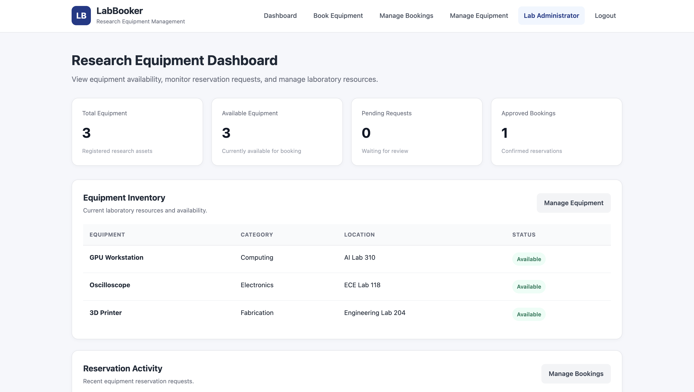
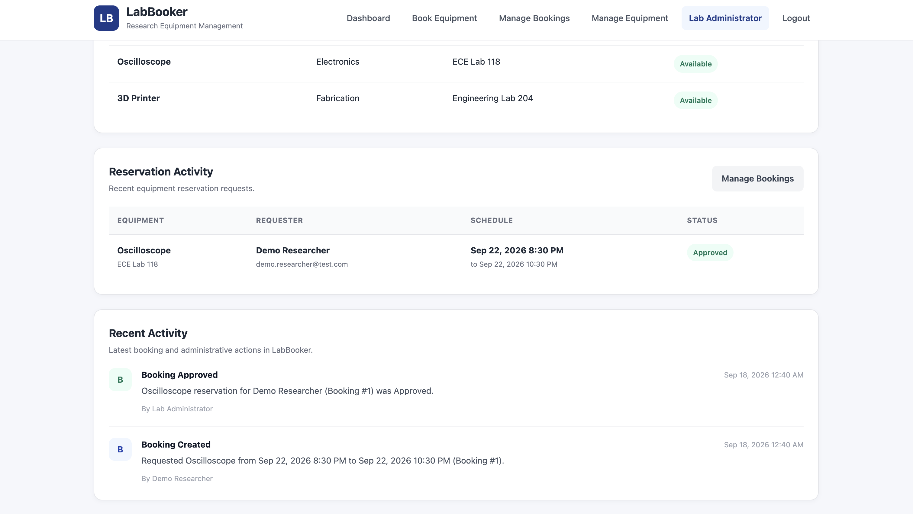
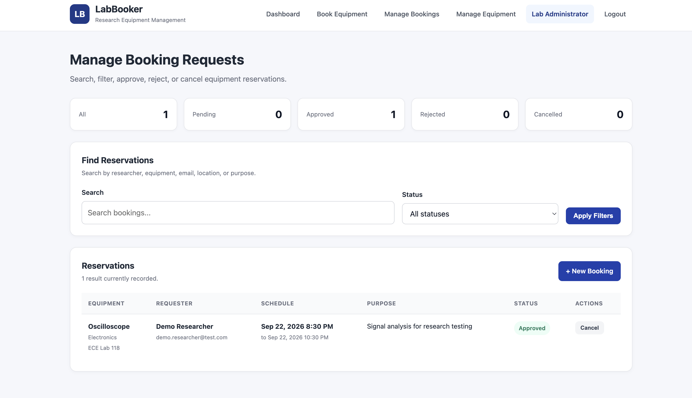
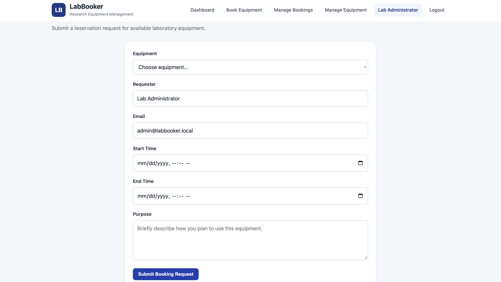
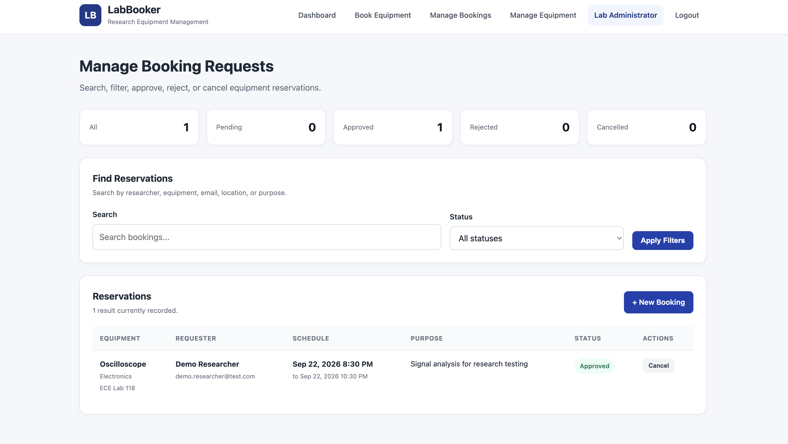

# LabBooker — Research Equipment Reservation System

LabBooker is a PHP and SQLite web application for managing shared laboratory and research equipment.

The system allows researchers to create accounts, request equipment reservations, track their bookings, and avoid scheduling conflicts. Administrators can manage equipment, review reservation requests, approve or reject bookings, update equipment availability, and view recent system activity.

**Live Demo:** https://labbooker-php.onrender.com

---

## Features

### User Features

- User registration and login
- Secure password hashing
- Browse available research equipment
- Submit equipment booking requests
- Automatic booking conflict detection
- View personal reservation history
- Track booking status
- Cancel active reservations
- Responsive interface for desktop and mobile

### Administrator Features

- Admin-only protected pages
- Manage booking requests
- Approve or reject pending reservations
- Cancel approved reservations
- Search bookings by researcher, equipment, email, location, or purpose
- Filter bookings by status
- View booking statistics
- Add new laboratory equipment
- Edit equipment details
- Change equipment status between Available, Maintenance, and Unavailable
- View recent booking and equipment activity

---

## Booking Workflow

LabBooker models a practical laboratory reservation workflow:

1. A researcher creates an account and signs in.
2. The researcher selects available equipment.
3. A reservation request is submitted with a start time, end time, and purpose.
4. The system checks for overlapping Pending or Approved reservations.
5. Valid requests are saved with a Pending status.
6. An administrator reviews the request.
7. The administrator can approve or reject the reservation.
8. The researcher can view the updated status under My Bookings.
9. Important actions are recorded in the activity log.

---

## Conflict Detection

LabBooker prevents double-booking by checking whether a requested time interval overlaps with an existing Pending or Approved reservation for the same equipment.

A booking is rejected when the requested interval conflicts with an existing reservation.

This validation is performed on the server rather than relying only on the user interface.

---

## Activity Logging

The system records important actions including:

- Booking created
- Booking approved
- Booking rejected
- Booking cancelled
- Equipment added
- Equipment updated
- Equipment availability changed

Recent activity is displayed on the dashboard so administrators can quickly understand what has changed in the system.

---

## Security

LabBooker includes several security practices:

- Password hashing with PHP `password_hash()`
- Password verification with `password_verify()`
- Session-based authentication
- Role-based authorization
- Admin-only protected routes
- CSRF protection for sensitive form actions
- PDO prepared statements
- Server-side form validation
- HTML output escaping
- Environment-variable based production administrator configuration

Administrator credentials are not stored directly in the source code.

---

## Tech Stack

- PHP 8+
- SQLite
- PDO
- HTML5
- CSS3
- Native PHP sessions
- Render for deployment
- Git and GitHub for version control

---

## Database Structure

LabBooker uses SQLite with the following main tables.

### `users`

Stores registered users and administrators.

Important fields:

- `id`
- `name`
- `email`
- `password_hash`
- `role`
- `created_at`

### `equipment`

Stores laboratory resources.

Important fields:

- `id`
- `name`
- `category`
- `location`
- `status`

### `bookings`

Stores reservation requests.

Important fields:

- `id`
- `equipment_id`
- `requester`
- `requester_email`
- `start_at`
- `end_at`
- `purpose`
- `status`
- `created_at`

### `activity_log`

Stores significant actions performed within the system.

Important fields:

- `user_id`
- `actor_name`
- `action`
- `description`
- `created_at`

---

## Screenshots

### Dashboard Overview



### Reservation Activity and Audit Log



### Manage Bookings



### Manage Equipment


### Equipment Reservation Form



### Researcher Booking History



---

## Project Structure

```text
labbooker-php/
├── assets/
│   └── style.css
│
├── data/
│   └── labbooker.sqlite
│
├── screenshots/
│   ├── dashboard-overview.png
│   ├── dashboard-activity.png
│   ├── manage-bookings.png
│   ├── manage-equipment.png
│   ├── booking-form.png
│   └── my-bookings.png
│
├── booking_form.php
├── bookings.php
├── config.php
├── equipment.php
├── equipment_form.php
├── index.php
├── login.php
├── logout.php
├── my_bookings.php
├── register.php
├── Dockerfile
└── README.md
```

---

## Run Locally

Clone the repository:

```bash
git clone https://github.com/HaripriyaReddyPatil/labbooker-php.git
```

Move into the project directory:

```bash
cd labbooker-php
```

Start the PHP development server:

```bash
php -S localhost:8001
```

Then open:

```text
http://localhost:8001
```

The SQLite database and required tables are created automatically when the application runs.

---

## Production Administrator Setup

For production deployment, the administrator account can be configured using environment variables:

```text
LABBOOKER_ADMIN_NAME
LABBOOKER_ADMIN_EMAIL
LABBOOKER_ADMIN_PASSWORD
```

This keeps administrator credentials out of the source code.

---

## What This Project Demonstrates

LabBooker demonstrates practical full-stack and backend development concepts including:

- Authentication and authorization
- CRUD operations
- Relational database queries
- SQL joins
- Server-side validation
- Scheduling business rules
- Booking conflict detection
- Status-based workflows
- Prepared database queries
- Security controls
- Activity logging
- Responsive interface design
- PHP application deployment
- Git-based development workflow

---

## Future Improvements

Possible extensions include:

- Equipment availability calendar
- Email notifications
- Administrator notes on rejected reservations
- Recurring reservations
- User profile management
- Booking analytics
- Equipment usage reports
- Automated testing
- Dedicated production database for larger deployments

---

## Author

**Haripriya Reddy Patil**

GitHub: https://github.com/HaripriyaReddyPatil